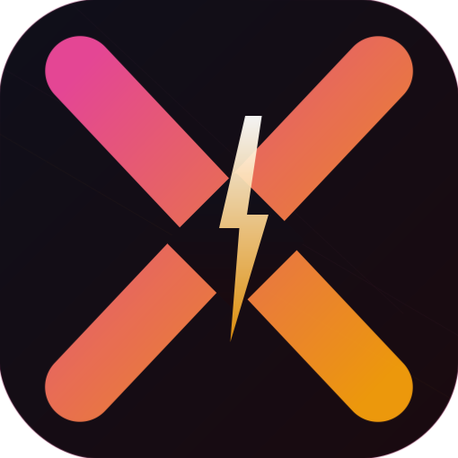

<div align="center">
  
  <h1>PhysiqueX</h1>
  <p><strong>A Premium, High-Performance Workout Tracker for Aesthetic Excellence</strong></p>
  
  [](https://expo.dev)
  [](https://reactnative.dev)
  [](#)
</div>

<br />

## ⚡ Overview
**PhysiqueX** is a streamlined, single-page training application designed for athletes who prioritize efficiency and consistency. Built with React Native and Expo, it features a unique weekly cycle management system that keeps you focused on your current goals while preserving your hard-earned progress.

## 🚀 Key Features

### 📅 Optimized Weekly Cycles
Unlike standard trackers that reset every 24 hours, PhysiqueX operates on a **7-day window (Mon-Sun)**.
- **Persistent Progress**: Your checkmarks and completions stay visible all week, allowing you to track your 7-day volume at a glance.
- **Automatic Reset**: The entire cycle resets fresh every Monday morning.
- **Smart Launch**: The app automatically detects the current day of the week and highlights the relevant training block for you.

### 💾 "Stick" Weight Logic
Your strength data is valuable. PhysiqueX utilizes **Persistent Weight Storage** (v4 Schema):
- Weights do not reset with the week.
- Once you set a weight for an exercise, it sticks. When you're ready to overload, just update it manually.
- Shared exercise logic: Update most weights once, and they sync across the entire week.

### 🚶 Active Recovery Tracking
Integrated **Step Counter** with a daily 10,000-step goal.
- Real-time Pedometer integration.
- Manual toggle for active recovery completion.
- Interactive progress bar with automatic daily resets for activity.

### 💎 Premium Aesthetics
- **Single-Page Architecture**: Zero-friction navigation. No tabs, no modals—just pure training.
- **Dark Mode by Design**: Optimized for gym environments with a high-contrast nocturnal palette.
- **Lucide Iconography**: Clean, modern visual language for intuitive use.

## 🛠 Tech Stack
- **Framework**: Expo Router (v3)
- **State Management**: Zustand (with AsyncStorage Persistence)
- **Sensors**: Expo Pedometer
- **UI Components**: React Native Safe Area Context, Lucide-React-Native
- **Styling**: Native StyleSheet for maximum performance

## Project Structure

```bash
├── app/
│   ├── _layout.tsx    # Root configuration
│   └── index.tsx      # Main application (PhysiqueX Hub)
├── assets/            # Branding and Icons
├── hooks/
│   └── useWorkoutStore.ts # Central State Logic (Zustand)
└── android/           # Native Android Production Build
```

## Get Started

1. **Install dependencies**
   ```bash
   npm install
   ```

2. **Run on Android (Production Build)**
   ```bash
   npx expo run:android --variant release
   ```

---
<div align="center">
  Built for athletes. Driven by data. 🦾
</div>
# PhysiqueX
